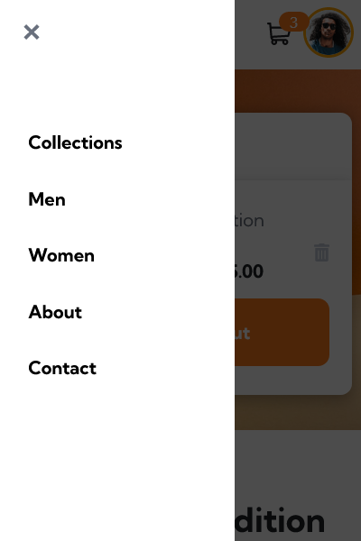

# Frontend Mentor - E-commerce product page solution

This is a solution to the [E-commerce product page coding challenge](https://www.frontendmentor.io/challenges/ecommerce-product-page-UPsZ9MJp6). Frontend Mentor challenges help you improve your coding skills by building realistic projects.

## Table of contents

- [Overview](#overview)
    - [The challenge](#the-challenge)
    - [Screenshots](#screenshots)
    - [Links](#links)
- [My process](#my-process)
    - [Built with](#built-with)
    - [What I learned](#what-i-learned)
    - [Continued development](#continued-development)
    - [Useful resources](#useful-resources)
- [Author](#author)
- [Acknowledgments](#acknowledgments)

## Overview

### The challenge

* This frontendmentor.io challenge consists of an example **product page for an e-commerce web application**.  

* There is a navigation bar with a working cart which **users are able to add or remove items to**. 

* In the center of the page, there is the **product display** which consists of different images of the product which **users can toggle through using the thumbnails below the current image or their left and right arrow keys**. 

* When the current image gets clicked, it opens the **lightbox viewing mode**. 

* There are two functional buttons used to **add and remove items to the cart**. 

* As for mobile, there is a sidebar which can be toggled.

### Screenshots

#### Desktop - Regular

#### Desktop - Active States

#### Desktop - Light Box View

#### Mobile - Regular

#### Mobile - Active States

#### Mobile - Navigation

### Links

- [Live site](https://ecommerce-product-page-shinthantkg.netlify.app)

## My process

### Built with

- Semantic HTML5 markup
- SCSS custom properties
- Flexbox
- Desktop-first workflow
- [React](https://reactjs.org/) - JS library
- [Vite](https://vitejs.dev) - Build tool

### What I learned

This is the first time ever I have used ReactJS and I never watched a YouTube tutorial or took a course on it. All I did was pick the project from frontendmentor.io, set up a Vite React project using WebStorm and got started working right away. Of course, the way I learned was through doing the official React Quickstart Tutorial, asking ChatGPT questions, etc. It was extremely fun to learn this way compared to just sitting there watching YouTube tutorials and I probably learned more effectively. I am also confident to say that I am getting pretty good at Responsive Design and my knowledge of the box model has improved throughout building this project.

### Useful resources

- [ReactJS Official Documentation](https://react.dev) - A great place to start learning ReactJS.
- [ChatGPT](https://chat.openai.com) - I used this as my personal ReactJS tutor.
- [MDN Web Docs](https://developer.mozilla.com) - This is an amazing resource which I used as a reference a lot to figure out certain JavaScript methods, etc.
- [Stack Overflow](https://stackoverflow.com/) - This is a must-use website for asking questions about your problems in coding.

## Author

- GitHub - [@shinthantkg](https://www.github.com/shinthantkg)
- Frontend Mentor - [@shinthantkg](https://www.frontendmentor.io/profile/shinthantkg)

## Acknowledgments

I know this is the most saturated and given advice, but just start! Take me as an example, I went from a complete ReactJS noob to a some-what okay developer after this project. So, just believe in yourself, step out of your comfort zone and you got this!
